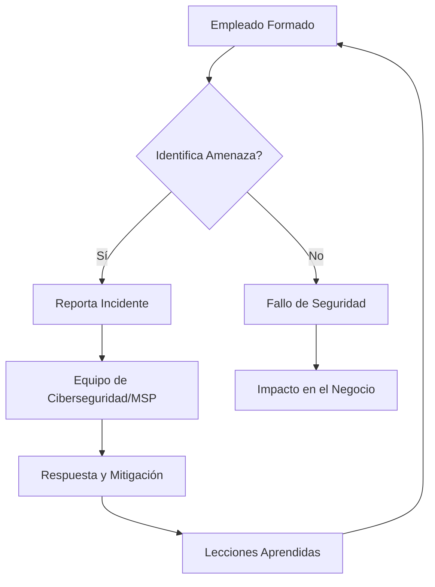

El pasado 29 de septiembre, el **II Congreso de Ciberseguridad para Pymes** organizado por CyberMadrid, el Clúster de Ciberseguridad de la capital, reunió a expertos y empresas para abordar los desafíos digitales de las pequeñas y medianas empresas. La jornada, celebrada en el Centro de Innovación DIGITALIZA MADRID, dejó claras las prioridades y las soluciones accesibles para este segmento empresarial.

El consenso general fue rotundo: la ciberseguridad ha trascendido la esfera puramente tecnológica. Hoy, es un factor crítico para la continuidad operativa, la competitividad y la viabilidad de cualquier negocio.

## El Eje Central: La Ciberseguridad como Pilar de Negocio

El congreso partió de una premisa ineludible: la ciberseguridad ya no es un gasto opcional, sino una inversión estratégica. Las Pymes, a menudo percibidas como objetivos menores, son en realidad un blanco frecuente y vulnerable para los ciberdelincuentes.

Los ataques pueden paralizar la facturación, comprometer datos sensibles y dañar la reputación de forma irreparable. La resiliencia digital se ha convertido en un requisito fundamental para operar en el mercado actual.

## La Estrategia de Madrid: Apoyo Institucional y Centros Demostradores

Las administraciones públicas, a través de la Agencia de Ciberseguridad de la Comunidad de Madrid y el Centro de Ciberseguridad del Ayuntamiento de Madrid (CCMAD), destacaron su compromiso. Alfonso Alcalá, subdirector general de Operaciones de la Agencia, puso a disposición de las empresas el Centro Demostrador de Ciberseguridad.

Este espacio permite a las organizaciones conocer y probar soluciones de protección. Mabel González, del CCMAD, enfatizó la necesidad de formación continua y la colaboración público-privada, subrayando que la ciberseguridad es una "responsabilidad compartida".

## Soluciones Adaptadas: Desmontando el Mito del Gran Presupuesto

Uno de los mensajes más potentes del congreso fue la desmitificación de la idea de que una Pyme necesita una gran estructura o presupuesto para protegerse. Se presentaron alternativas prácticas y asumibles.

Modelos como el **Virtual CISO** permiten a las empresas acceder a experiencia de alto nivel sin la necesidad de contratar un directivo a tiempo completo. Los **SOC gestionados o externalizados** ofrecen monitorización 24/7 y respuesta a incidentes, democratizando el acceso a capacidades avanzadas.

Otras soluciones incluyen evaluaciones de seguridad, monitorización de la superficie de ataque y servicios especializados. Estas opciones permiten a las Pymes elevar su nivel de protección de forma eficiente y escalable.

## El Factor Humano y la IA: La Primera Línea de Defensa y sus Nuevos Riesgos

El congreso concluyó que las personas son la primera y más crítica línea de defensa. La concienciación y la formación de los empleados deben ser continuas y adaptadas a la evolución de las amenazas.

No basta con sesiones puntuales; se requieren ejercicios prácticos que permitan a los trabajadores reconocer y actuar ante situaciones de riesgo. La inversión en formación es directamente proporcional a la reducción de incidentes.

La Inteligencia Artificial también ocupó un lugar central. Si bien ofrece nuevas oportunidades, introduce riesgos significativos. Es crucial que las empresas establezcan políticas claras de uso de herramientas de IA, definiendo qué información puede introducirse y para qué usos están autorizadas.

> ⚠️ **Advertencia:** La falta de políticas claras sobre el uso de la Inteligencia Artificial en el entorno empresarial puede exponer datos corporativos sensibles y abrir nuevas vías de ataque para la ingeniería social avanzada.

### Diagrama de Flujo: La Cadena de Defensa Humana

Este diagrama ilustra cómo la formación del empleado es el primer eslabón crítico en la cadena de defensa. Un fallo en este punto puede llevar directamente a un impacto en el negocio.

La importancia de conocer la exposición digital, evaluar los riesgos de terceros y proteger adecuadamente las identidades y accesos fue otro punto clave. Para profundizar en cómo la IA está transformando el panorama de amenazas, puede leer nuestro análisis sobre la [IA Ofensiva: El Nuevo Campo de Batalla de la Confianza Digital para Pymes](/blog/ia-ofensiva-confianza-digital-pymes-protegerse/).

## Blindaje Proactivo: Acciones Inmediatas para su Pyme

Para las Pymes, la prevención es la estrategia más rentable. Implementar medidas de seguridad básicas y avanzadas no requiere presupuestos desorbitados, sino una estrategia bien definida.

Soluciones como la autenticación multifactor (MFA) son un pilar fundamental para proteger las identidades. Un gestor de identidades Zero-Knowledge y túneles VPN en malla seguros son esenciales para blindar el acceso a los recursos corporativos.

Un partner tecnológico como Solutech puede ayudar a implementar estas medidas, desde la configuración de un SOC gestionado hasta la formación continua de los empleados. Nuestro enfoque preventivo busca anticipar y neutralizar las amenazas antes de que afecten a su operativa diaria.

> 💡 **Accede aquí:** [Guía para Implementar MFA Obligatorio en su Servidor SSH](/guias/implementar-mfa-obligatorio-servidor-ssh) (*Proteja sus accesos críticos con autenticación multifactor*).

## La Viabilidad en Juego: Invertir es Siempre Más Barato que Recuperar

Miguel Garrido de la Cierva, presidente de CEIM, clausuró el congreso con una reflexión contundente: "si una pyme no está preparada y sufre un ataque puede estar en juego su propia viabilidad". Esta afirmación subraya la urgencia de integrar la ciberseguridad en la gestión cotidiana.

Invertir en prevención, formación permanente, preparación ante incidentes y el acceso a servicios especializados es la única vía para elevar significativamente el nivel de protección. La ciberseguridad es, en definitiva, una inversión en la supervivencia y el crecimiento del negocio.

### ¿Qué es un Virtual CISO y cómo beneficia a una Pyme?
Un Virtual CISO (Chief Information Security Officer) es un servicio externalizado que proporciona experiencia en ciberseguridad de alto nivel a una Pyme. Permite acceder a conocimientos estratégicos y tácticos sin el coste de un empleado a tiempo completo, ayudando a definir la estrategia de seguridad y a cumplir normativas.

### ¿Por qué es tan importante la formación continua en ciberseguridad para los empleados?
La formación continua es vital porque los ciberataques evolucionan constantemente. Los empleados son la primera línea de defensa y necesitan estar actualizados sobre las últimas amenazas (phishing, ingeniería social, etc.) para reconocerlas y actuar correctamente, reduciendo drásticamente el riesgo de incidentes.

### ¿Cómo puede una Pyme con presupuesto limitado mejorar su ciberseguridad?
Una Pyme puede mejorar su ciberseguridad priorizando medidas de alto impacto como la autenticación multifactor (MFA), copias de seguridad inmutables, formación básica de empleados y la contratación de servicios gestionados (SOC o Virtual CISO) que ofrecen capacidades avanzadas a un coste fraccionado.