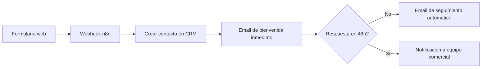
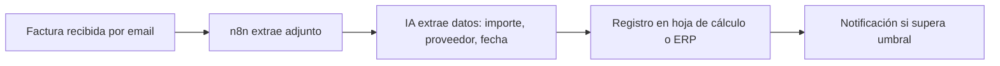

## Tabla de contenidos

1. [Introducción](#introducción)
2. [Qué es realmente la IA (y qué no es)](#qué-es-realmente-la-ia-y-qué-no-es)
3. [Beneficios reales por área de negocio](#beneficios-reales-por-área-de-negocio)
4. [Casos de uso por sector](#casos-de-uso-por-sector)
5. [Herramientas recomendadas: comparativa](#herramientas-recomendadas-comparativa)
6. [Automatizaciones que puedes montar ya](#automatizaciones-que-puedes-montar-ya)
7. [Más de 50 prompts profesionales listos para usar](#más-de-50-prompts-profesionales-listos-para-usar)
8. [Riesgos, RGPD y uso responsable](#riesgos-rgpd-y-uso-responsable)
9. [Checklist de implantación](#checklist-de-implantación)
10. [Preguntas frecuentes](#preguntas-frecuentes)
11. [Conclusión](#conclusión)

---

## Introducción

Una pyme española media pierde entre 5 y 8 horas semanales por empleado en tareas que no generan valor: redactar el mismo tipo de correo, buscar información dispersa en carpetas, copiar datos de una factura a un Excel, resumir reuniones a mano. No es un problema de esfuerzo, es un problema de diseño de procesos.

La IA generativa (modelos como ChatGPT, Claude o Gemini) y la automatización de flujos (n8n, Zapier, Make) no son "el futuro". Son herramientas de coste marginal casi nulo que hoy, en 2026, cualquier autónomo o pyme puede empezar a usar en una tarde. El coste de no adoptarlas no es quedarse igual: es quedarse por detrás de un competidor que sí las usa y que factura las mismas horas a más clientes.

Esta guía no vende humo. No vamos a decirte que "la IA lo cambia todo" sin más. Vamos a mostrarte, con ejemplos concretos, qué automatizar primero, con qué herramienta, con qué prompt exacto, y qué riesgos legales y de seguridad tienes que controlar antes de tocar nada.

Tres ideas que vertebran todo el documento:

- **Ahorro de tiempo real, no teórico.** Cada sección incluye una estimación de horas ahorradas por tarea.
- **Automatización antes que "magia".** El 80% del valor de la IA en una pyme viene de automatizar procesos repetitivos, no de generar contenido creativo.
- **Competitividad silenciosa.** Las empresas que mejor están usando IA en Almería y Murcia no lo cuentan en redes sociales. Lo aplican en back-office y lo notan en el margen.

---

## Qué es realmente la IA (y qué no es)

### Eliminando mitos

**Mito 1: "La IA piensa por sí misma."** No. Un modelo de lenguaje predice la siguiente palabra más probable en base a patrones estadísticos aprendidos de textos. No razona como un humano, no tiene intenciones ni comprende el mundo. Es una herramienta de generación de texto extraordinariamente útil, no una consciencia.

**Mito 2: "La IA sustituye a un empleado."** En la inmensa mayoría de pymes, la IA no sustituye puestos completos: elimina tareas concretas dentro de un puesto. Un administrativo que dedicaba 2 horas diarias a introducir datos de facturas puede dedicar esas 2 horas a atención al cliente o análisis. El puesto no desaparece, cambia de foco.

**Mito 3: "Cuanto más cara la herramienta, mejor resultado."** Falso. El 90% de los casos de uso en una pyme se resuelven con planes gratuitos o de 20€/mes. La inversión seria llega después, cuando ya sabes exactamente qué proceso automatizar.

**Mito 4: "Es solo para empresas tecnológicas."** Los sectores que más están ganando productividad con IA ahora mismo son asesorías, clínicas, talleres y construcción — precisamente por lo repetitivo de su papeleo.

### Qué puede hacer hoy la IA generativa

- Redactar, resumir, traducir y corregir texto en segundos.
- Analizar documentos largos (contratos, facturas, informes) y extraer datos estructurados.
- Responder preguntas frecuentes de clientes con contexto de tu empresa.
- Generar código y automatizaciones sin ser programador.
- Transcribir y resumir reuniones o llamadas.
- Clasificar y priorizar correos, tickets o leads automáticamente.

### Qué NO puede hacer (todavía) de forma fiable

- Garantizar el 100% de exactitud en datos numéricos críticos sin supervisión humana (alucina cifras).
- Tomar decisiones legales o fiscales vinculantes sin revisión de un profesional.
- Sustituir el trato humano en negociaciones o venta consultiva compleja.
- Acceder a información privada o interna sin que se la proporciones tú (no "sabe" de tu empresa por defecto).
- Mantener consistencia perfecta en tareas de precisión extrema sin verificación (por ejemplo, cálculos contables complejos).

### Cuándo merece la pena y cuándo no

| Merece la pena | No merece la pena (todavía) |
|---|---|
| Tareas repetitivas de alto volumen (correos, resúmenes, clasificación) | Decisiones estratégicas de una sola vez y bajo volumen |
| Procesos con reglas claras (si pasa X, haz Y) | Procesos donde el criterio humano es el producto (asesoría personalizada de alto valor) |
| Generación de primeros borradores | Documentos legales finales sin revisión humana |
| Atención al cliente de primer nivel (FAQs) | Gestión de crisis o quejas graves |

---

## Beneficios reales por área de negocio

### Ahorro de tiempo

El beneficio más medible. Una redacción de presupuesto que tardaba 30 minutos con plantilla manual baja a 5 minutos con un asistente que ya conoce tus tarifas y formato. Multiplicado por 15-20 presupuestos al mes, son 6-8 horas mensuales recuperadas solo en esa tarea.

### Reducción de errores

Los errores humanos en tareas repetitivas (transcripción de datos, copia entre sistemas) tienden a aumentar con la fatiga y el volumen. Un flujo automatizado con validación no se cansa a las 18:00 del viernes.

### Automatización de procesos

No se trata de "usar ChatGPT", se trata de conectar herramientas: un formulario web dispara una automatización en n8n, que crea un contacto en tu CRM, envía un email de bienvenida y notifica por Telegram, todo sin que nadie toque un teclado.

### Análisis documental

Subir un contrato de 40 páginas y obtener en 30 segundos un resumen de las cláusulas de penalización, plazos y obligaciones. Esto, hecho a mano, son 45-60 minutos de lectura atenta.

### Atención al cliente

Un chatbot bien entrenado con tus FAQs reales resuelve el 60-70% de las consultas de primer nivel (horarios, precios, disponibilidad) sin intervención humana, liberando al equipo para casos complejos.

### Marketing

Generación de primeros borradores de posts, newsletters, anuncios y variantes A/B en minutos, siempre con revisión humana antes de publicar.

### Ventas

Cualificación automática de leads, resúmenes de llamadas comerciales, seguimiento automatizado de propuestas enviadas sin respuesta.

### Finanzas

Extracción automática de datos de facturas y tickets, conciliación asistida, generación de informes de gastos por categoría.

### Recursos Humanos

Cribado inicial de CVs contra un perfil definido, generación de ofertas de empleo, preparación de guiones de entrevista.

### IT

Documentación automática de incidencias, generación de scripts de mantenimiento, monitorización con alertas inteligentes que reducen falsos positivos.

### Administración

Redacción de comunicaciones internas, plantillas de contratos, actas de reuniones a partir de grabaciones.

---

## Casos de uso por sector

### Asesorías y despachos profesionales

Un despacho que gestiona 80 clientes recurrentes puede automatizar el recordatorio trimestral de documentación fiscal: un flujo en n8n revisa el calendario, genera un email personalizado por cliente con Claude y lo envía vía SMTP, con copia a Telegram si el cliente no responde en 5 días. Ahorro estimado: 4-6 horas/mes.

### Clínicas y centros de salud

Transcripción automática de la anamnesis dictada por el profesional, generación del informe estructurado y envío del resumen al paciente por email, todo revisado antes de enviar. Reduce el tiempo administrativo post-consulta en un 40%.

### Talleres mecánicos

Diagnóstico asistido: el mecánico dicta los síntomas del vehículo y la IA genera un presupuesto estructurado con las piezas y horas de mano de obra estimadas, que el taller ajusta y envía al cliente por WhatsApp o email.

### Empresas industriales

Documentación automática de no conformidades e informes de calidad a partir de notas de planta, reduciendo el tiempo de reporting de ISO 9001.

### Comercio

Generación automática de descripciones de producto para catálogo online a partir de una ficha técnica básica, y respuesta automática a preguntas frecuentes de clientes en redes sociales.

### Restauración

Gestión de reservas con confirmación automática, generación de menús estacionales y respuesta a reseñas online con un tono coherente con la marca.

### Logística

Seguimiento automatizado de incidencias en rutas, generación de partes de entrega y alertas proactivas a clientes ante retrasos.

### Arquitectura y construcción

Resumen automático de actas de obra, generación de checklists de seguridad por fase, y redacción de memorias descriptivas a partir de notas del arquitecto.

### Marketing y agencias

Generación masiva de variantes de copy para campañas, análisis de sentimiento de comentarios en redes y reporting automatizado de KPIs semanales.

### Microempresas y autónomos

Un autónomo que hace 10 presupuestos a la semana puede automatizar la plantilla, el seguimiento por email a los 3 días sin respuesta y el registro en una hoja de cálculo, todo con herramientas gratuitas.

---

## Herramientas recomendadas: comparativa

| Herramienta | Qué hace | Ventajas | Inconvenientes | Precio orientativo | Nivel recomendado |
|---|---|---|---|---|---|
| **ChatGPT** | Asistente conversacional generalista | Ecosistema maduro, buena integración con Office | Puede alucinar datos concretos sin verificar | Gratis / 20€ mes (Plus) | Iniciación |
| **Claude** | Asistente conversacional con foco en razonamiento y documentos largos | Excelente en análisis de documentos extensos y código; tono más natural | Menor ecosistema de plugins que ChatGPT | Gratis / 18-20€ mes | Iniciación-Intermedio |
| **Gemini** | Asistente integrado en Google Workspace | Integración nativa con Gmail, Docs y Sheets | Rendimiento variable en tareas complejas de razonamiento | Incluido en Workspace / gratis limitado | Iniciación |
| **Microsoft Copilot** | IA integrada en Word, Excel, Outlook, Teams | Ideal si ya usas Microsoft 365 | Coste adicional por licencia, requiere M365 | ~28€ mes/usuario | Intermedio |
| **Perplexity** | Motor de búsqueda con respuestas con fuentes citadas | Muy fiable para investigación con referencias verificables | No sustituye a un asistente de redacción | Gratis / 20€ mes | Iniciación |
| **NotebookLM** | Asistente de análisis sobre documentos propios subidos | Respuestas ancladas exclusivamente a tus documentos, reduce alucinaciones | Limitado a lo que subas, no navega por internet | Gratis | Intermedio |
| **n8n** | Plataforma de automatización de flujos (low-code) | Autoalojable, sin límites de ejecuciones si lo hospedas tú, muy flexible | Requiere curva de aprendizaje inicial | Gratis (autoalojado) / desde 20€ mes (cloud) | Intermedio-Avanzado |
| **Zapier** | Automatización de flujos entre apps SaaS | Enorme catálogo de integraciones, muy fácil de empezar | Precio escala rápido con el volumen de tareas | Gratis limitado / desde 20€ mes | Iniciación-Intermedio |
| **Make** | Automatización visual de flujos complejos | Interfaz visual potente para flujos con lógica compleja | Curva de aprendizaje mayor que Zapier | Gratis limitado / desde 9€ mes | Intermedio |
| **Cursor** | Editor de código con IA integrada | Excelente para desarrollo asistido por IA | Requiere conocimientos de programación | Gratis limitado / 20€ mes | Avanzado |
| **Claude Code** | Agente de IA para tareas de programación desde terminal | Automatiza tareas de desarrollo completas, no solo autocompletado | Pensado para perfiles técnicos | Incluido en planes de Claude | Avanzado |
| **GitHub Copilot** | Asistente de código integrado en el IDE | Muy extendido, buena integración con VS Code | Menos autónomo que agentes de código completos | ~10-19€ mes | Avanzado |

**Recomendación práctica de Solutech:** si empiezas de cero, combina Claude o ChatGPT para redacción y análisis con n8n para automatizar el flujo entre tus herramientas actuales (formulario web, email, CRM). No necesitas las doce herramientas de la tabla; con dos o tres bien conectadas cubres el 80% de los casos de uso de una pyme.

---

## Automatizaciones que puedes montar ya

### 1. Captación de leads automatizada

Ahorro estimado: elimina por completo el seguimiento manual de leads, evitando el "se me olvidó responder" que cuesta clientes.

### 2. Gestión de facturas entrantes

### 3. Documentación automática

Grabación de una reunión → transcripción automática → resumen estructurado con puntos de acción → envío por email a los asistentes. Reduce a cero el tiempo de "redactar el acta".

### 4. Atención al cliente de primer nivel

Chatbot conectado a una base de preguntas frecuentes reales de tu negocio, que escala a un humano cuando detecta que no puede resolver la consulta.

### 5. Presupuestos automatizados

Formulario de solicitud → IA genera un borrador de presupuesto según tus tarifas → revisión humana de 2 minutos → envío automático.

### 6. Copias de seguridad verificadas

Automatización que no solo hace el backup, sino que verifica su integridad y notifica por Telegram si algo falla, en lugar de descubrirlo cuando ya es tarde.

### 7. Resúmenes semanales de negocio

Cada lunes, un flujo recopila datos de ventas, tickets de soporte y leads de la semana anterior y genera un resumen ejecutivo automático.

### 8. Notificaciones inteligentes

En lugar de recibir 50 alertas de monitorización sin contexto, un flujo con IA agrupa y prioriza incidencias reales, reduciendo la fatiga de alertas.

---

## Más de 50 prompts profesionales listos para usar

### Atención al cliente

1. "Redacta una respuesta profesional y empática a este cliente que se queja de un retraso en la entrega: [pega el mensaje]"
2. "Convierte esta lista de preguntas frecuentes en un documento de FAQ claro, sin tecnicismos, para clientes que no son expertos: [pega las preguntas]"
3. "Resume esta conversación de soporte en 3 líneas para el CRM: [pega la conversación]"
4. "Genera 5 respuestas alternativas, de más formal a más cercana, para este email de reclamación: [pega el email]"
5. "Escribe un mensaje de disculpa profesional para un cliente afectado por una caída de servicio de 2 horas, sin sonar robótico."

### Marketing

6. "Escribe 3 variantes de un anuncio para Instagram sobre [servicio], dirigido a pymes de menos de 20 empleados, con un hook distinto en cada una."
7. "Genera un calendario de contenido para LinkedIn de 4 semanas sobre [tema], con un post técnico y uno de caso de éxito cada semana."
8. "Convierte este caso de éxito de cliente en un post de blog de 600 palabras, con un titular que no suene a publicidad: [pega el caso]"
9. "Escribe 10 titulares alternativos para este artículo, optimizados para búsqueda en Google: [pega el título actual]"
10. "Resume este informe de 20 páginas en un post de LinkedIn de máximo 1000 caracteres, con 3 datos clave destacados: [pega el informe]"

### Ventas

11. "Redacta un email de seguimiento para un presupuesto enviado hace 5 días sin respuesta, sin sonar insistente."
12. "Genera un guion de llamada de 5 minutos para cualificar a un lead que ha pedido información sobre [servicio]."
13. "Resume esta transcripción de llamada comercial y extrae los 3 próximos pasos acordados: [pega la transcripción]"
14. "Escribe una propuesta comercial estructurada a partir de estos puntos sueltos: [pega notas]"
15. "Genera 5 objeciones habituales que un cliente de [sector] podría poner a este servicio, y una respuesta para cada una."

### Finanzas y administración

16. "Extrae en formato tabla los siguientes datos de esta factura: proveedor, fecha, importe base, IVA, total: [pega el texto de la factura]"
17. "Clasifica estos gastos por categoría contable (suministros, personal, marketing, etc.): [pega lista de gastos]"
18. "Redacta un recordatorio de pago pendiente, tono profesional pero firme, para un cliente con 15 días de retraso."
19. "Resume este contrato de 15 páginas destacando plazos, penalizaciones y condiciones de rescisión: [pega el contrato]"
20. "Genera una plantilla de presupuesto profesional en formato tabla para el servicio de [nombre del servicio]."

### Recursos Humanos

21. "Redacta una oferta de empleo para el puesto de [puesto], tono cercano, sin clichés de 'buscamos crack'."
22. "Genera 8 preguntas de entrevista técnica para evaluar experiencia real en [habilidad], no solo teoría."
23. "Resume los puntos fuertes y débiles de este CV en relación al puesto de [puesto]: [pega el CV]"
24. "Escribe un email de bienvenida para un nuevo empleado que empieza el lunes, con el tono de nuestra empresa: [describe el tono]"
25. "Redacta una política interna breve sobre uso de dispositivos personales en el trabajo."

### IT y operaciones

26. "Redacta la documentación de esta incidencia técnica en formato ticket, para que cualquier compañero pueda entenderla: [pega notas técnicas]"
27. "Genera un script en bash que haga una copia de seguridad de esta carpeta y la suba a Google Drive con rclone."
28. "Explica esta configuración de firewall en lenguaje sencillo para un cliente no técnico: [pega la configuración]"
29. "Escribe un procedimiento estándar (SOP) para el proceso de onboarding de un nuevo cliente en nuestro sistema de monitorización."
30. "Resume este log de errores e identifica el patrón más repetido: [pega el log]"

### Gestión de proyectos

31. "Convierte esta lista de tareas sueltas en un plan de proyecto con hitos y dependencias: [pega la lista]"
32. "Redacta un acta de reunión estructurada a partir de esta transcripción: [pega la transcripción]"
33. "Genera un email de actualización de estado de proyecto para el cliente, con un tono profesional y sin tecnicismos."
34. "Identifica los riesgos principales de este plan de proyecto y sugiere mitigaciones: [pega el plan]"
35. "Resume el estado de estas 10 tareas en una tabla con columnas: tarea, responsable, estado, próxima fecha."

### Contenido y comunicación

36. "Reescribe este texto técnico para que lo entienda alguien sin conocimientos de informática, sin perder precisión: [pega el texto]"
37. "Corrige la gramática y el estilo de este texto sin cambiar el tono ni el contenido: [pega el texto]"
38. "Genera 5 preguntas frecuentes que un cliente potencial tendría sobre [servicio], con respuestas breves y claras."
39. "Traduce este texto al inglés manteniendo un tono B2B profesional: [pega el texto]"
40. "Resume este artículo de 2000 palabras en un párrafo de 100 palabras, conservando los datos más relevantes: [pega el artículo]"

### Estrategia y análisis

41. "Analiza estos datos de ventas mensuales y detecta la tendencia principal: [pega los datos]"
42. "Compara estas tres opciones de proveedor según coste, tiempo de implantación y riesgo, en formato tabla: [describe las opciones]"
43. "Genera un análisis DAFO breve para este nuevo servicio que queremos lanzar: [describe el servicio]"
44. "Identifica 3 riesgos que no hemos considerado en este plan de negocio: [pega el plan]"
45. "Resume las conclusiones clave de este informe sectorial en 5 puntos accionables: [pega el informe]"

### Automatización y procesos

46. "Diseña el flujo de un proceso de automatización para [proceso], indicando disparador, pasos y condiciones."
47. "Genera un JSON de ejemplo para el webhook que recibiría los datos de este formulario: [describe los campos]"
48. "Escribe la lógica en pseudocódigo para clasificar automáticamente estos tickets según urgencia: [describe los criterios]"
49. "Sugiere qué pasos de este proceso manual se podrían automatizar primero, ordenados por impacto: [describe el proceso]"
50. "Genera un checklist de verificación para antes de activar una automatización en producción."

### Uso interno y productividad personal

51. "Resume mis notas de la reunión de hoy en 3 puntos de acción con responsable y fecha: [pega las notas]"
52. "Prioriza esta lista de 15 tareas según urgencia e impacto, en formato tabla: [pega la lista]"
53. "Redacta un email breve pidiendo una prórroga de 3 días en la entrega de este proyecto, sin sonar poco profesional."

---

## Riesgos, RGPD y uso responsable

### Alucinaciones

Los modelos de IA generativa pueden producir información que suena convincente pero es incorrecta, especialmente en datos numéricos, fechas o citas legales. **Regla de oro: cualquier dato que vaya a un cliente, contrato o presupuesto debe ser verificado por una persona antes de enviarse.**

### Privacidad y RGPD

Antes de subir cualquier documento con datos personales a una herramienta de IA, verifica:

- Si la herramienta usa tus datos para entrenar sus modelos (revisa la configuración de privacidad; en la mayoría de planes de pago esto está desactivado por defecto).
- Si existe un acuerdo de tratamiento de datos (DPA) disponible, especialmente si vas a subir datos de clientes.
- Si los datos que vas a introducir son estrictamente necesarios (principio de minimización de datos del RGPD).

**Nunca subas a un chat de IA de consumo (versión gratuita sin acuerdo empresarial):** DNI, historiales médicos, datos bancarios completos o cualquier dato especialmente protegido, salvo que uses una herramienta con garantías empresariales contractuales explícitas.

### Protección de datos en automatizaciones

Si usas n8n u otra herramienta de automatización, asegúrate de que los webhooks están protegidos con autenticación y de que los datos personales que circulan por el flujo se almacenan cifrados y con acceso restringido (por ejemplo, RLS si usas una base de datos como Supabase).

### Errores comunes de las empresas al adoptar IA

- Automatizar un proceso mal diseñado, en lugar de arreglarlo primero: la automatización solo amplifica lo que ya haces, bien o mal.
- No revisar los primeros resultados durante las primeras semanas, confiando ciegamente en la IA desde el primer día.
- Comprar herramientas por moda sin definir antes qué proceso concreto se quiere mejorar.
- No formar al equipo: una herramienta potente en manos de alguien sin criterio para verificar el resultado genera más riesgo que beneficio.

### Uso responsable

La IA debe tratarse como un empleado junior con mucha rapidez pero sin experiencia: produce buenos primeros borradores, pero necesita supervisión antes de que su trabajo salga de la empresa.

---

## Checklist de implantación

- [ ] Identifica una única tarea repetitiva que te quite más de 3 horas semanales.
- [ ] Documenta el proceso actual tal cual se hace hoy, paso a paso.
- [ ] Elige una herramienta de IA generativa (ChatGPT o Claude) para probar la parte de generación de texto.
- [ ] Prueba manualmente el prompt durante una semana antes de automatizar nada.
- [ ] Si el proceso implica varias herramientas (email, CRM, hoja de cálculo), evalúa automatizarlo con n8n, Zapier o Make.
- [ ] Verifica qué datos personales intervienen en el proceso y revisa el cumplimiento RGPD antes de automatizar.
- [ ] Define un punto de revisión humana obligatoria antes de que cualquier output llegue a un cliente.
- [ ] Mide el tiempo ahorrado durante el primer mes de forma objetiva.
- [ ] Forma a las personas que usarán la herramienta, no solo la implantes técnicamente.
- [ ] Documenta el proceso final para que sea repetible sin depender de una sola persona.

---

## Preguntas frecuentes

### ¿Necesito saber programar para automatizar procesos con IA?
No. Herramientas como n8n, Zapier o Make usan interfaces visuales de arrastrar y soltar. Programar ayuda para casos avanzados, pero no es un requisito de entrada.

### ¿Cuánto cuesta empezar a usar IA en mi empresa?
Puedes empezar con 0€ usando planes gratuitos de ChatGPT o Claude. La automatización básica con n8n autoalojado también puede ser gratuita si ya tienes un servidor.

### ¿Qué diferencia hay entre ChatGPT y Claude?
Ambos son asistentes conversacionales potentes. Claude tiende a rendir mejor en análisis de documentos largos y tareas de razonamiento estructurado; ChatGPT tiene un ecosistema de plugins más amplio. Para la mayoría de pymes, cualquiera de los dos cubre las necesidades básicas.

### ¿La IA va a sustituir a mis empleados?
En la mayoría de pymes, no. La IA elimina tareas repetitivas dentro de un puesto, no el puesto completo. El valor está en redirigir ese tiempo a tareas de mayor impacto.

### ¿Es seguro subir documentos de clientes a ChatGPT o Claude?
Depende del plan y la configuración. En los planes empresariales, los datos no se usan para entrenar modelos por defecto. En los planes gratuitos de consumo, revisa siempre la política de privacidad antes de subir datos sensibles.

### ¿Qué es n8n y por qué se recomienda tanto?
Es una plataforma de automatización de flujos de trabajo, similar a Zapier, pero que se puede autoalojar en tu propio servidor sin límites de ejecuciones ni coste recurrente por uso.

### ¿Puedo usar IA para redactar contratos?
Puedes usarla para generar un primer borrador, pero cualquier documento legal final debe ser revisado por un profesional cualificado. La IA no sustituye el criterio jurídico.

### ¿Cómo evito que la IA "invente" datos?
Verificando siempre los datos numéricos y factuales antes de que salgan de tu empresa, y usando herramientas como NotebookLM que limitan las respuestas a documentos que tú proporcionas.

### ¿Qué proceso debería automatizar primero?
El que más tiempo consuma de forma repetitiva y tenga reglas claras: normalmente, la gestión de leads, facturas o comunicaciones recurrentes con clientes.

### ¿Necesito un departamento de IT para implantar esto?
No necesariamente uno interno. Muchas pymes trabajan con un proveedor externo (MSP) que diseña e implanta las automatizaciones sin necesidad de contratar personal técnico propio.

### ¿Qué es el RGPD y cómo afecta al uso de IA?
Es el Reglamento General de Protección de Datos europeo. Afecta directamente si tratas datos personales con herramientas de IA: debes minimizar los datos que compartes, verificar los acuerdos de tratamiento de datos de cada proveedor y garantizar la seguridad de los flujos automatizados.

### ¿Puedo automatizar la atención al cliente por completo?
No de forma recomendable. Lo óptimo es automatizar el primer nivel (preguntas frecuentes, disponibilidad, horarios) y escalar a una persona los casos complejos o sensibles.

### ¿Qué pasa si la automatización falla?
Debe existir siempre un sistema de notificación de errores (por ejemplo, alertas a Telegram) y un proceso manual de respaldo mientras se soluciona.

### ¿Cuánto tiempo se tarda en ver resultados?
Para tareas simples de generación de texto, los resultados son inmediatos. Para automatizaciones completas de un proceso, entre 1 y 4 semanas de diseño e implantación, dependiendo de la complejidad.

### ¿Puedo usar IA sin conexión a internet?
Los modelos de IA generativa más potentes (ChatGPT, Claude, Gemini) requieren conexión, ya que se ejecutan en la nube. Existen modelos locales, pero requieren más recursos técnicos y suelen rendir peor.

### ¿Qué es un prompt?
Es la instrucción que le das a un modelo de IA para obtener un resultado. Cuanto más específico y contextualizado (rol, objetivo, formato de salida), mejor será la respuesta.

### ¿Puedo entrenar a la IA con los datos de mi empresa?
No es necesario "entrenar" el modelo en el sentido técnico. Basta con proporcionarle contexto (documentos, tono, ejemplos) en cada conversación o mediante herramientas como NotebookLM.

### ¿Qué diferencia hay entre automatización e inteligencia artificial?
La automatización ejecuta reglas predefinidas ("si pasa X, haz Y"). La IA generativa añade la capacidad de generar contenido nuevo (texto, resúmenes, clasificaciones) dentro de esas reglas.

### ¿Es rentable para un autónomo o solo para empresas grandes?
Es especialmente rentable para autónomos, porque cada hora recuperada es una hora que se puede dedicar a facturar o a la vida personal, sin necesidad de contratar a nadie.

### ¿Qué pasa con los errores de la IA en temas legales o fiscales?
La responsabilidad final es siempre humana. La IA puede generar borradores, pero cualquier decisión con implicaciones legales o fiscales debe ser validada por un profesional.

---

## Conclusión

No hace falta transformar toda la empresa de golpe. Empieza por una sola tarea que hoy te quita horas de forma repetitiva, pruébala con una herramienta gratuita durante una semana, mide el tiempo ahorrado y, solo entonces, plantéate automatizarla de principio a fin.

La diferencia entre las empresas que sacan partido real a la IA y las que solo hablan de ella no está en el presupuesto, está en empezar por lo pequeño y medible. El resto llega solo.
